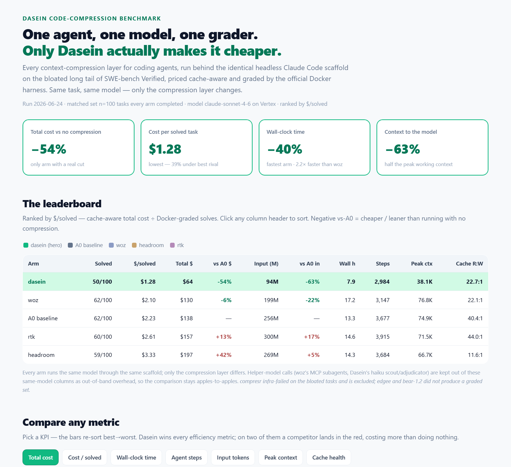

<h1 align="center">Code-Compression Bench</h1>

<p align="center">
  <b>A reproducible, apples-to-apples benchmark of context-compression layers for coding agents.</b><br>
  One fixed agent. One model. Same tasks, same grader. <b>Only the compression layer changes.</b>
</p>

<p align="center">
  <i>Built and maintained by <a href="https://daseinlabs.ai">Dasein</a> as an open resource for the industry.</i>
</p>

<p align="center">
  <a href="https://raw.githack.com/daseinlabs/code-compression-bench/master/results/2026-06-24/dashboard.html"><b>▶ Open the interactive dashboard</b></a> &nbsp;·&nbsp;
  <a href="results/2026-06-24/">Full results &amp; method</a> &nbsp;·&nbsp;
  <a href="results/2026-06-24/fact-vs-fiction.md">Fact vs fiction</a> &nbsp;·&nbsp;
  <a href="results/2026-06-24/paired.csv">Raw per-task data</a>
</p>

---

<h3 align="center">On the tasks where context management actually matters,<br>Dasein is the only layer that makes the agent <i>cheaper</i> — by a mile.</h3>

<p align="center">
  <b>−54% total cost · −63% context · −40% wall-clock time · $1.28 per solved task (lowest of any arm).</b><br>
  The best competitor shaves ~6%. Two competitors cost <i>more</i> than running with no compression at all.
</p>

<p align="center">
  <a href="https://raw.githack.com/daseinlabs/code-compression-bench/master/results/2026-06-24/dashboard.html">
    
  </a>
</p>

> _Latest run: **2026-06-24** · the bloated long tail of [SWE-bench Verified](https://www.swebench.com/) · **n=100 matched tasks** every arm completed · model `claude-sonnet-4-6` on Vertex · cache-aware pricing · official SWE-bench Docker grader._

---

## The 30-second version

Every "we cut your tokens by N%" claim is measured on a different agent, a different task set, and a
different success bar — so none of them are comparable, and none answer the only question that matters:
**does the agent still solve the problem, and what did it cost end-to-end?**

This benchmark holds **everything fixed except the compression layer** — one scaffold (headless **Claude
Code**), one model (`claude-sonnet-4-6` on Vertex), one frozen task set, one official Docker grader — and
prices every arm with the **same cache-aware table**. Whatever moves is attributable to the layer.

The result is lopsided. **Dasein wins every efficiency metric on the board** — cost, cost-per-solved,
tokens, steps, wall-clock time, peak context — and it is the **only** arm that delivers a real cost cut.

<table>
<tr><th align="left">Rank</th><th align="left">Arm</th><th align="right">Solved</th><th align="right">$/solved&nbsp;▼</th><th align="right">Total&nbsp;cost</th><th align="right">vs&nbsp;A0&nbsp;cost</th><th align="right">vs&nbsp;A0&nbsp;context</th><th align="right">Wall&nbsp;time</th><th align="right">Cache&nbsp;R:W</th></tr>
<tr><td>🟢&nbsp;<b>1</b></td><td>🟢&nbsp;<b>dasein</b></td><td align="right">50/100</td><td align="right"><b>$1.28</b></td><td align="right"><b>$64.21</b></td><td align="right"><b>−54%</b></td><td align="right"><b>−63%</b></td><td align="right"><b>7.9&nbsp;h</b></td><td align="right">22.7</td></tr>
<tr><td>2</td><td>woz</td><td align="right">62/100</td><td align="right">$2.10</td><td align="right">$130.29</td><td align="right">−6%</td><td align="right">−22%</td><td align="right">17.2&nbsp;h</td><td align="right">22.1</td></tr>
<tr><td>3</td><td>A0 <i>(baseline)</i></td><td align="right">62/100</td><td align="right">$2.23</td><td align="right">$138.17</td><td align="right">—</td><td align="right">—</td><td align="right">13.3&nbsp;h</td><td align="right">40.4</td></tr>
<tr><td>4</td><td>rtk</td><td align="right">60/100</td><td align="right">$2.61</td><td align="right">$156.72</td><td align="right">+13%</td><td align="right">+17%</td><td align="right">14.6&nbsp;h</td><td align="right">44.0</td></tr>
<tr><td>5</td><td>headroom</td><td align="right">59/100</td><td align="right">$3.33</td><td align="right">$196.65</td><td align="right">+42%</td><td align="right">+5%</td><td align="right">14.3&nbsp;h</td><td align="right">11.6</td></tr>
</table>

Ranked by **`$/solved`** — cache-aware total cost ÷ Docker-graded solves — the one number that can't be
gamed by either lever alone. _`A0` is the no-compression control. `compresr` infra-failed on the bloated
tasks and is excluded; `edgee` and `bear-1.2` did not produce a graded set ([details](#fact-vs-fiction))._

---

## 1 · The cost story  💰

This is the whole reason a compression layer exists, and it is where the field separates.

**Dasein runs the entire 100-task set for `$64.21` — less than half of every other arm**, and turns in the
lowest cost *per solved task* at **`$1.28`**, 39% under the cheapest competitor and 43% under the
no-compression baseline. Because `$/solved` divides real dollars by *graded* solves, it already accounts
for the fact that Dasein solves a few fewer tasks on this brutal slice — and Dasein still wins it outright.

The losers are the surprise. **`rtk` (+13%) and `headroom` (+42%) cost *more* than running with no
compression at all.** Shipping fewer visible tokens is necessary for a saving, but it is not sufficient: the
bill only falls when the layer removes the *right* tokens without churning the prompt cache or forcing extra
turns. `woz` lands roughly cost-neutral (−6%). Only Dasein turns compression into money.

<p align="center">
  
  
</p>

## 2 · The speed &amp; steps story  ⏱️

Cheaper is only half of it — Dasein is also the **fastest** and the **tightest**.

- **Wall-clock: `7.9 h`** to grind through all 100 tasks — **40% faster than the baseline and 2.2× faster
  than `woz`** (17.2 h, the slowest arm: its delegated-exploration subagents add round-trips and push mean
  per-call latency to 13.0 s vs Dasein's 7.9 s).
- **Steps: `2,984`** — the **fewest** of any arm (`rtk` takes the most at 3,915). A leaner context means the
  agent reaches the fix in fewer turns and wastes less of its budget circling.

<p align="center">
  
  
</p>

## 3 · Under the hood: why the bill moves  🔧

Cost and time are *outcomes*. The mechanism is the context the model actually has to carry, and how stable
the prompt cache stays underneath it.

- **Peak working context: `38K` tokens** on average — literally **half** the live context every other arm
  hands the model (~67–77K). This is compression doing its job: the model thinks against a tight, curated
  window instead of a sprawling transcript.
- **Cache health.** A coding agent re-sends a long, growing prompt every turn; a healthy run *reads* that
  cached prefix far more often than it *rewrites* it. `headroom` drops to **11.6:1** — roughly half the reuse
  of the next arm — so it keeps re-paying the cache-*write* rate, which is exactly why it ends up the most
  expensive arm despite barely changing the token count. Dasein curates aggressively yet keeps the cache
  comfortably healthy (22.7:1).

<p align="center">
  
  
</p>

## 4 · Cheap *and* correct  🎯

The honest tension: on this deliberately hard, context-heavy slice, **Dasein trades a few raw solves
(50/100 vs the baseline's 62) for less than half the cost.** That trade is exactly why the leaderboard ranks
on **`$/solved`** and not raw solve count — a metric a layer could game by burning a fortune. Down is
cheaper, right solves more, so the optimal corner is **bottom-right**, and Dasein owns the cheapest tier by
a wide margin while solve rates cluster 50–62% across *every* arm (baseline included).

<p align="center">
  
</p>

---

## Every number  📋

One catch-all table; nothing hidden. Best value in each column is **bold**. <code>vs A0</code> columns:
negative = leaner/cheaper than no compression.

| KPI | 🟢 **dasein** | woz | A0 *(baseline)* | rtk | headroom |
|---|---:|---:|---:|---:|---:|
| **Solved / 100** | 50 | **62** | **62** | 60 | 59 |
| **Solve rate** | 50% | **62%** | **62%** | 60% | 59% |
| **$ / solved task** ▼ | **$1.28** | $2.10 | $2.23 | $2.61 | $3.33 |
| **Total cost** ▼ | **$64.21** | $130.29 | $138.17 | $156.72 | $196.65 |
| List-price cost *(no cache)* ▼ | **$287** | $613 | $803 | $805 | $735 |
| vs A0 cost | **−54%** | −6% | — | +13% | +42% |
| **Input tokens** ▼ | **94.1M** | 199.2M | 255.9M | 300.3M | 268.9M |
| vs A0 input | **−63%** | −22% | — | +17% | +5% |
| Output tokens ▼ | **1.46M** | 2.69M | 2.55M | 2.80M | 2.70M |
| **Agent steps** ▼ | **2,984** | 3,147 | 3,677 | 3,915 | 3,684 |
| **Wall-clock** ▼ | **7.9 h** | 17.2 h | 13.3 h | 14.6 h | 14.3 h |
| Mean latency / call ▼ | **7.9 s** | 13.0 s | 9.0 s | 9.4 s | 10.4 s |
| **Peak context** *(mean)* ▼ | **38.1K** | 76.8K | 74.9K | 71.5K | 66.7K |
| Cache hit rate | 92.7% | 93.4% | **95.9%** | 92.2% | 88.2% |
| Cache read:write | 22.7 | 22.1 | 40.4 | **44.0** | 11.6 *(weakest)* |
| Limit-deaths | **0** | **0** | **0** | **0** | 1 |
| API calls | 3,085 | 3,247 | 3,686 | 4,454 | 4,128 |

<sub>`A0` is the no-compression control; its `vs A0` cells are zero by construction. A lower cache read:write
ratio means the layer re-pays the cache-*write* rate more often; headroom's 11.6 is the weakest by far —
roughly half the reuse of the next arm. Helper-model calls (woz's MCP subagents, Dasein's haiku scout/adjudicator) are kept out of these same-model
columns as out-of-band overhead, so the comparison stays apples-to-apples — wall-clock, which the user feels
regardless of which model does the work, is the one place that overhead shows up.</sub>

---

## Fact vs fiction

Every competitor advertises a large token-or-cost cut — **measured on an easier proxy**: single-shot QA
benchmarks, or shell-command output in isolation, often behind an "up to" ceiling. Put the same layer behind
a *real, multi-turn coding agent* on hard, context-heavy tasks and price the actual cache-aware bill, and the
headline number evaporates — or reverses. That gap is the entire point of this benchmark.

| Layer | What they advertise | What we observed (n=100, behind a live agent) | Verdict |
|---|---|---|:--:|
| **woz** | *"Reduces token consumption &amp; cost by 50%"* · *"30–40% faster"* ([wozcode.com](https://www.wozcode.com/), [YC](https://www.ycombinator.com/companies/woz)) | −6% cost, −22% input, **same solves as baseline**, and **+30% *slower*** wall-clock | ⚠️ Overstated |
| **rtk** | *"Reduces LLM token consumption by **60–90%** on common dev commands"* ([github](https://github.com/rtk-ai/rtk)) | **+17% input, +13% cost** — its hook only rewrites *shell* output; the agent's native Read/Grep/Edit bypass it entirely | 🔴 Backfired |
| **headroom** | *"**60–95% fewer tokens**, same answers"* · *"better caching"* ([github](https://github.com/chopratejas/headroom)) | **+5% input, +42% cost (worst arm)**; weakest cache reuse by far — it *churns* the cache it claims to stabilize | 🔴 Backfired |
| **compresr** | *"**100× compression**"* · *"76% cheaper"* on FinanceBench ([compresr.ai](https://compresr.ai/)) | **Infra-failed** on the live agentic tasks — could not complete the matched set | ⚫ DNF |
| **edgee** | *"Cut token costs **up to 50%**"* ([edgee.ai](https://www.edgee.ai/)) | No graded run; by its own docs it *"rebuilds RTK functionality"* — same shell-output ceiling | ⚫ n/a |
| **bear-1.2** | *"10–40% token reduction"* — but *"**not designed for code**"* ([The Token Company](https://thetokencompany.com/)) | Access-gated, no self-serve API → documented no-op | ⚫ n/a |
| 🟢 **dasein** | Curates the agent's **full working context** at serve time | **−54% cost, −63% context, $1.28/solved, fastest, fewest steps** | ✅ Delivers |

The common thread: `rtk` and `edgee` compress **shell output**, a sliver of a coding agent's bill;
`headroom`, `compresr`, and `bear` benchmark on **single-shot QA** (GSM8K, SQuAD, FinanceBench) or
explicitly not-code. Dasein curates the part of the prompt that *actually grows every turn* — which is why
it's the only layer whose savings survive contact with a real agent. **Full sourced breakdown:
[`results/2026-06-24/fact-vs-fiction.md`](results/2026-06-24/fact-vs-fiction.md).**

---

## Explore it yourself

<p align="center">
  <a href="https://raw.githack.com/daseinlabs/code-compression-bench/master/results/2026-06-24/dashboard.html">
    
  </a>
</p>

<p align="center"><a href="https://raw.githack.com/daseinlabs/code-compression-bench/master/results/2026-06-24/dashboard.html"><b>▶ Open the live interactive dashboard</b></a> — sort the leaderboard, toggle any KPI, hover the frontier.</p>

## How the benchmark is built

This benchmark fixes everything except the compression layer:

- **One scaffold** — a fixed agent: headless **Claude Code**, driven through the Python Claude Agent SDK.
- **One model** — **`claude-sonnet-4-6` on Vertex** for every arm, reached through an internal **usage
  gateway** that sits at the bottom of every chain, so it always observes the **real post-compression
  usage** (cache split included) and writes a per-run ledger.
- **One task set** — the context-bloated long tail of **SWE-bench Verified** (long tool-output trails,
  repeated reads, deep call stacks — the regime that separates a real layer from a no-op). The latest run
  covers 100 instances that every arm completed; the exact list is in
  [`paired.csv`](results/2026-06-24/paired.csv).
- **One grader** — the **official SWE-bench Verified Docker harness**. A fix counts only if the repo's
  `fail_to_pass` tests pass and `pass_to_pass` stays intact. No partial credit, no LLM judge.
- **One price table** — cache-aware Sonnet-4.6 pricing (`uncached $3.00 · cache-write $3.75 · cache-read
  $0.30 · output $15.00` per 1M), applied **identically to every arm's real per-call usage**.

Each compression product plugs in through its **native interface** (proxy / API / MCP / hook) — we don't
reimplement anyone's method. The grader doesn't care how a patch was produced, which is what makes the
comparison fair.

### Arms

| Arm | What it is | Integration |
|---|---|---|
| **Dasein** | Curates the agent's context at serve time with a learned model, wrapped in a full run-governance stack | Hosted, keyed service |
| **Woz** | Claude Code plugin: AST-aware tools + delegated exploration | MCP tool layer |
| **RTK** | Single Rust binary: shell-command-output compression via a Claude Code PreToolUse hook | Install binary; runs as a hook (model gateway-direct, like A0) |
| **Headroom** | Open-source, reversible context compression (6-signal scorer) | Self-host (Anthropic-native proxy) |
| **Edgee** | Open-source gateway: deterministic tool-output compression | Hosted gateway / self-host |
| **Compresr** | "Context Gateway" proxy: history + tool-output compaction | Self-host / hosted proxy |
| **Baseline (A0)** | The identical bare agent, no compression | — |

> _`compresr` is wired but infra-failed on the bloated tasks (not a graded loss); `edgee` and `bear-1.2`
> (The Token Company) are wired and will activate when they produce a clean graded run._

### Why `$/solved` is the fair metric

A layer that strips context aggressively can look cheap on raw tokens while quietly failing more tasks; a
layer that solves a lot can look strong while burning a fortune. **`$/solved` = cache-aware cost ÷
Docker-graded solves** rewards the layer that delivers correct patches for the least money — which is what a
team actually pays for. Cost is **cache-aware** because a coding agent re-sends a long, growing prompt every
turn and the API bills a cached prefix far cheaper than fresh input; a layer that shrinks the visible prompt
but rewrites the cache every turn does *not* actually save money, and `$/solved` exposes that.

### Honest caveats

- **This is the hard, bloated long tail on purpose.** Solve rates run ~50–62% across *all* arms including
  the baseline. These numbers characterize the regime where context management matters most; gaps would
  shrink on short, easy-to-localize tasks where there is little to compress.
- **Matched set, baseline-cost-ranked prefix (preliminary).** Every number is over the n=100 tasks all arms
  completed — a prefix skewed toward the highest-baseline-cost tasks (where compression saves most), gated by
  the slowest arm. Treat absolute magnitudes as preliminary; the solve-count gap of a task or two is within
  noise, which is why the ranking is `$/solved`.
- **Single scaffold and model.** Holding both fixed is what makes the per-arm delta clean, but it also means
  these numbers are specific to headless Claude Code on `claude-sonnet-4-6`.
- **Cache-aware pricing is the honest frame, applied to everyone.** A naive list-price frame would flatter
  the shorter-prompt arms; we don't use it for the headline. The same table prices Dasein exactly as it
  prices every other arm.

## Reproduce it

```bash
pip install -e .
gcloud auth application-default login        # model = claude-sonnet on Vertex, ADC on the box
cp .env.example .env                          # MODEL + per-arm endpoints/keys
make selfhost-up                              # self-host proxy arms (edgee/headroom/compresr)
make smoke                                    # 1 task per ready arm, end-to-end + grade
make bench                                    # the full bloated set across every ready arm
make report                                   # figures + leaderboard + README injection
```

Arms whose keys/endpoints aren't configured are skipped automatically
(`python -m bench.cc_runner --list-arms` shows what's ready). Every figure and table is regenerated from a
single `summary.json`, so anyone who runs this gets the same numbers — nothing here is hand-edited.

## Layout

```
bench/      core: arm interface, runner, grader, pricing, figures, report
arms/       one adapter per compression layer (transform / proxy / tool)
selfhost/   docker-compose for the self-hosted proxy arms
results/    per-run records, figures, the interactive dashboard, and the generated reports
```

## License

Apache-2.0. Compression products referenced here are the property of their respective owners; this repo
contains only thin client adapters to their public interfaces. The `dasein` arm is a thin over-the-wire
client to a hosted service — this public repo contains **no Dasein internals**.

<p align="center"><sub>Benchmark sponsored and operated by <a href="https://daseinlabs.ai">Dasein</a> and deliberately built to be neutral: one fixed scaffold and model, an official third-party grader, one shared price table. Anyone can re-run it and check the numbers. · 2026-06-24</sub></p>
