<h1 align="center">Code-Compression Bench</h1>

<p align="center">
  A reproducible, like-for-like benchmark of context-compression layers for coding agents.<br>
  One fixed agent, one model, one grader. Only the compression layer changes.
</p>

<p align="center">
  Built and maintained by <a href="https://daseinlabs.ai">Dasein</a> as an open resource for the industry.
</p>

<p align="center">
  <a href="FACT-VS-FICTION.md">Vendor claims vs measured</a> &nbsp;·&nbsp;
  <a href="results/2026-07-04/">Full results &amp; method</a> &nbsp;·&nbsp;
  <a href="results/2026-07-04/paired.csv">Per-task data</a> &nbsp;·&nbsp;
  <a href="https://raw.githack.com/daseinlabs/code-compression-bench/master/results/2026-07-04/dashboard.html">Interactive dashboard</a>
</p>

---

## Overview

Every "we cut your tokens by N%" claim is measured on a different agent, a different task set, and a
different success bar, so none of them are comparable, and none answer the question that matters: does the
agent still solve the problem, and what did it cost end to end? This benchmark fixes everything except the
compression layer. One scaffold (headless Claude Code), one model (`claude-sonnet-4-6`), 100 tasks from
SWE-bench Verified, and the official SWE-bench Docker grader are held identical for every arm; only the
compression layer changes, so any difference in cost or quality is attributable to it. Arms are ranked by
**cost per solved task** — cache-aware total cost divided by the tasks the grader passed — the figure a
coding team actually pays per result.

> Run 2026-07-04 · 100 tasks from SWE-bench Verified · model `claude-sonnet-4-6` · cache-aware pricing ·
> official SWE-bench Docker grader.

## Leaderboard

| # | Arm | Solved | $ / solved | vs base | Total cost | vs base | Input | vs base | Wall-clock | vs base | Cache R:W |
|---:|---|---:|---:|---:|---:|---:|---:|---:|---:|---:|---:|
| 1 | **Dasein** | **62 / 100** | **$1.45** | **−44%** | **$89.65** | **−39%** | **144.8M** | **−54%** | **10.8 h** | **−25%** | 22.6 |
| 2 | Woz | 55 / 100 | $2.33 | −10% | $128.28 | −13% | 203.1M | −35% | 17.8 h | +23% | 24.7 |
| 3 | Baseline (no compression) | 57 / 100 | $2.58 | — | $147.30 | — | 312.2M | — | 14.4 h | — | 41.6 |
| 4 | RTK | 54 / 100 | $3.07 | +19% | $165.77 | +13% | 360.7M | +16% | 16.2 h | +12% | 46.4 |
| 5 | Headroom | 58 / 100 | $3.66 | +42% | $212.14 | +44% | 329.6M | +6% | 16.3 h | +13% | 11.3 |

Dasein solves the most tasks of any arm — **62 of 100**, five more than the no-compression baseline — while
running the full set for **$89.65**, the lowest total cost, and the lowest cost per solved task at **$1.45**,
44% below the baseline's $2.58; the next-cheapest arm (Woz) costs $2.33, 61% more per solved task. Woz also
cuts total cost versus the baseline (−13%); RTK (+13%) and Headroom (+44%) cost more than the baseline.
Dasein is the only arm that both solves more tasks than the baseline and costs less; Woz is the one other
arm below the baseline on cost per solved task.

The cache-aware pricing above is the conservative frame. Even at undiscounted list price — no cache
assumptions at all — the ordering at the top is identical and the gap wider: Dasein costs **$456** to the
baseline's **$862** (−47%), against $613–805 for the other arms.

<p align="center">
  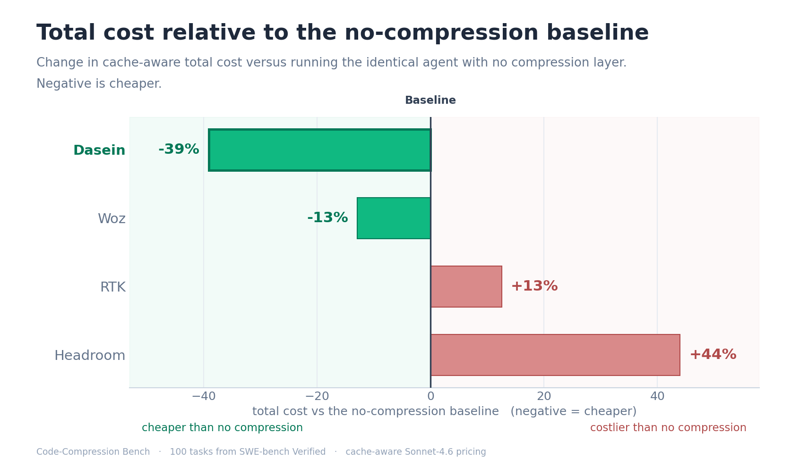
</p>

<p align="center">
  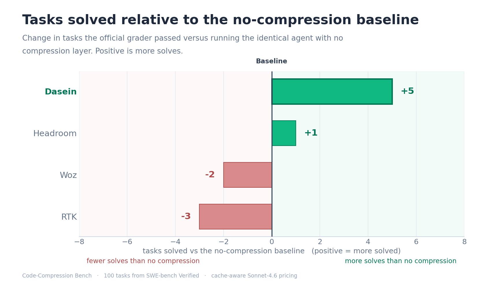
</p>

## Cost

<p align="center">
  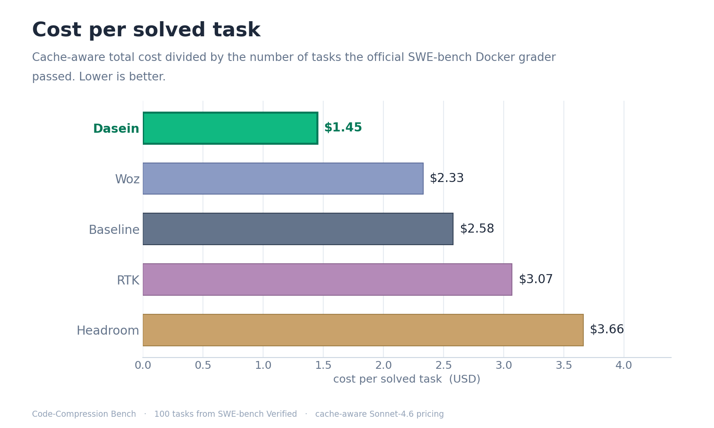
  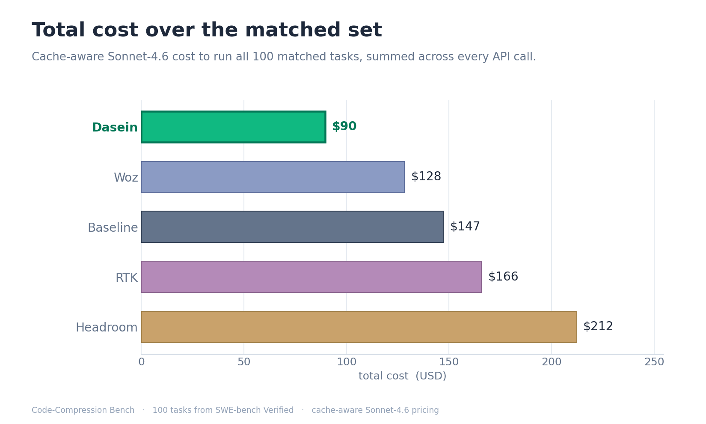

</p>

Shipping fewer visible tokens is necessary for a real saving but not sufficient. Under cache-aware pricing
the model re-reads a long, mostly-cached prompt every turn, and a cached prefix is billed far below fresh
input. A layer that trims the visible prompt but rewrites the cached prefix each turn re-pays the expensive
cache-write rate; the bill only falls when the layer removes the *right* tokens without churning the cache or
adding turns. That is why a layer can reduce its token counts and still end up more expensive
than the baseline: the ranking tracks dollars, not tokens.

## Time and steps

<p align="center">
  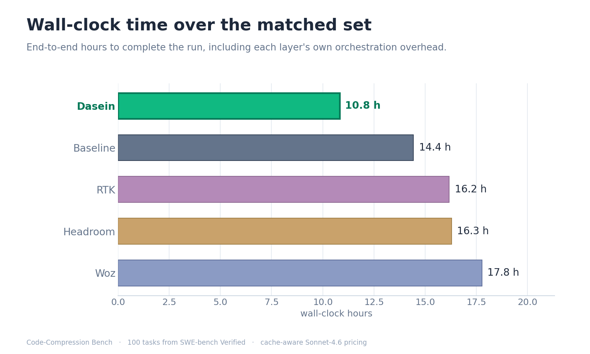
  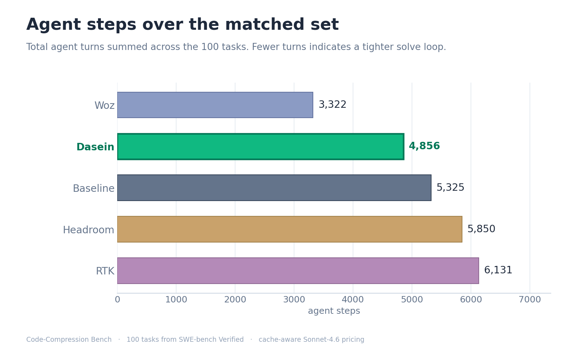
</p>

Dasein completed the run in **10.8 hours**, 25% faster than the no-compression baseline and the fastest of
any arm, with the lowest mean per-call latency (6.2 s versus the baseline's 8.8 s). Woz was the slowest at
17.8 hours — 23% slower than the baseline — with the highest per-call latency (14.3 s).

## Cost and time together

<p align="center">
  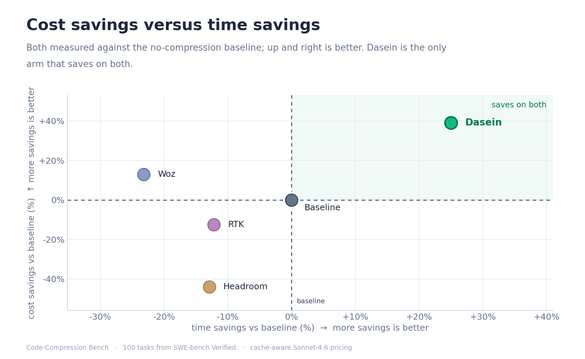
</p>

The chart plots cost savings against time savings, both against the baseline. The upper-right region saves
on both; Dasein (−39% cost, −25% wall-clock time) is the only layer in it.

## Where the cost comes from

<p align="center">
  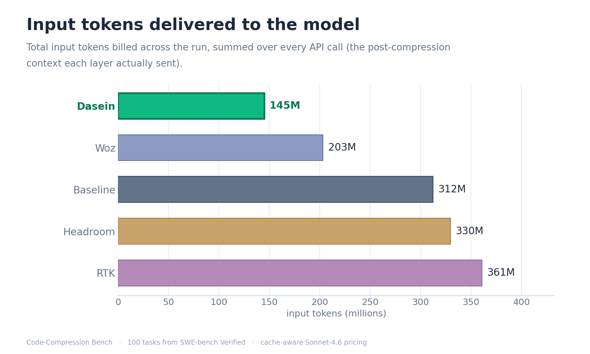
  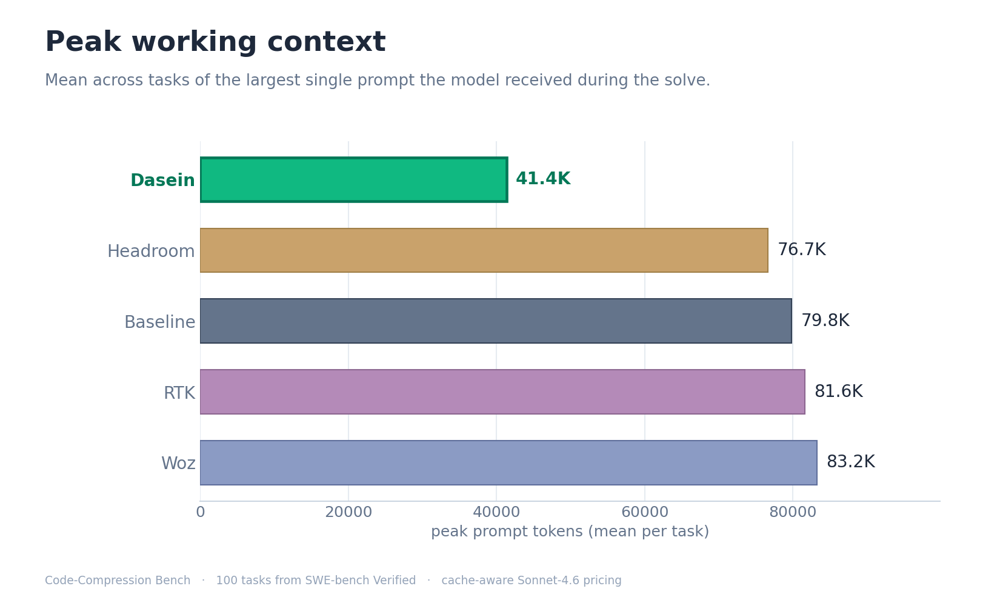
</p>

Cost and time are outcomes; the drivers are how much context the model carries and how stable the prompt
cache stays underneath it. Dasein delivers **54% fewer input tokens** than the baseline and holds the model's
peak working context at **41K tokens on average — about half** the 77–83K every other arm carries. It
also produces the fewest output tokens of any arm — **1.71M, 43% below the baseline** — which matters
because output is billed at the highest rate ($15 per million), so generating less of it weighs most on the
bill.

<p align="center">
  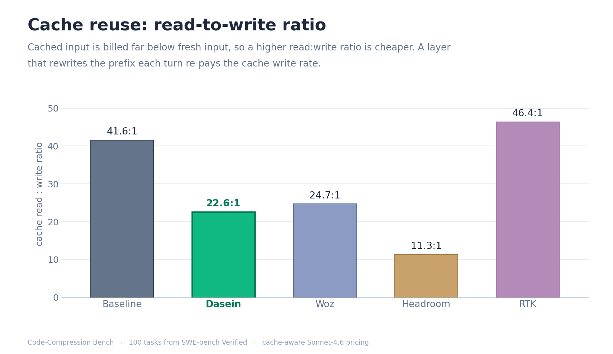
</p>

Cache reuse explains the most expensive arm. A cached prefix is billed far below fresh input, so a higher
read:write ratio is cheaper. Headroom's ratio is 11.3, the lowest of any arm — it rewrites the cached prefix often enough to re-pay
the cache-write rate repeatedly, which is why it is the most expensive arm (+44%) even though its own input
tokens barely move (+6%). Dasein's ratio (22.6) sits below the baseline's (41.6) for the opposite, benign
reason: it carries far less cached context to begin with, so there is simply less cached prefix to re-read —
fewer reads over a small, stable prefix, not more writes — and its bill still falls 39%.

## Savings versus solve rate

<p align="center">
  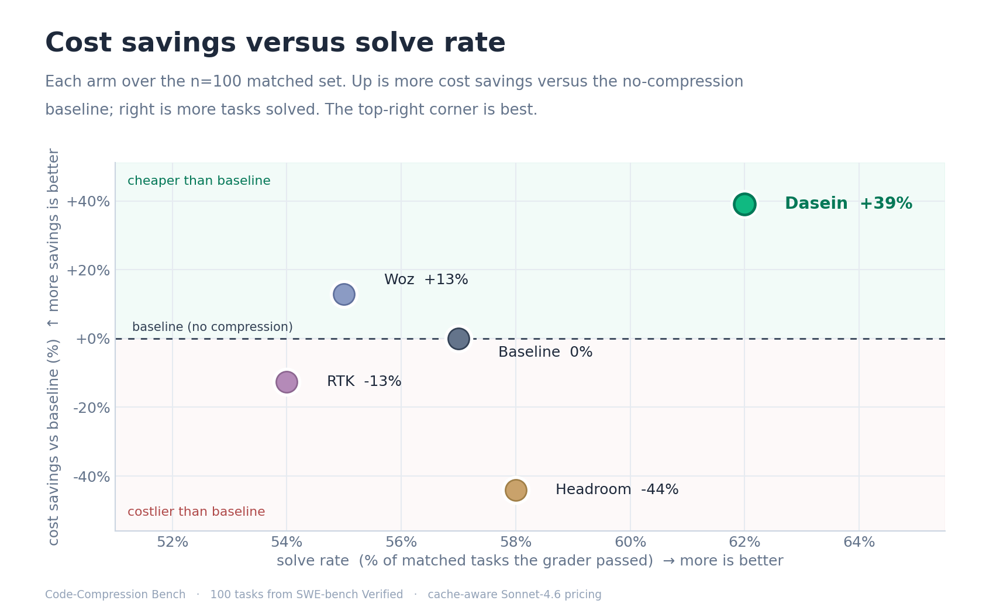
</p>

The chart plots each layer by cost savings (vertical) and solve rate (horizontal), both against the
baseline. The upper-right region is cheaper and solves more; Dasein (62 solved, −39% cost) is the only layer
in it.

## Every measured value

The complete per-arm rollup. Best value in each row is in bold.

| KPI | Dasein | Woz | Baseline | RTK | Headroom |
|---|---:|---:|---:|---:|---:|
| Tasks solved (of 100) | **62** | 55 | 57 | 54 | 58 |
| Cost per solved task | **$1.45** | $2.33 | $2.58 | $3.07 | $3.66 |
| Cost per solved task vs baseline | **−44%** | −10% | — | +19% | +42% |
| Total cost | **$89.65** | $128.28 | $147.30 | $165.77 | $212.14 |
| List-price cost (no cache discount) | **$456** | $635 | $862 | $1,015 | $908 |
| Total cost vs baseline | **−39%** | −13% | — | +13% | +44% |
| Input tokens | **144.8M** | 203.1M | 312.2M | 360.7M | 329.6M |
| Input tokens vs baseline | **−54%** | −35% | — | +16% | +6% |
| Output tokens | **1.71M** | 2.95M | 3.00M | 3.22M | 2.95M |
| Agent steps | 4,856 | **3,322** | 5,325 | 6,131 | 5,850 |
| Wall-clock hours | **10.8** | 17.8 | 14.4 | 16.2 | 16.3 |
| Mean latency per call | **6.2 s** | 14.3 s | 8.8 s | 9.3 s | 8.0 s |
| Peak working context (mean) | **41.4K** | 83.2K | 79.8K | 81.6K | 76.7K |
| Cache hit rate | 93.9% | 95.0% | 97.0% | **97.3%** | 92.4% |
| Cache read:write ratio | 22.6 | 24.7 | 41.6 | **46.4** | 11.3 |
| Runs ended by context limit | 3 | **0** | 2 | 2 | **0** |
| API calls | 4,683 | 3,005 | 4,084 | 4,964 | 4,504 |

Cache read:write is the ratio of cached-prefix reads to cache writes; a lower ratio means the layer re-pays
the cache-write rate more often.

## Vendor claims versus measured

Each of the other layers advertises a large reduction in tokens, cost, or latency, but none of those headline
numbers is measured on what a coding team actually pays for — the cache-aware dollar cost of solving real
repository tasks with a multi-turn agent. They are measured on single-shot question-answering, single-document
QA, shell-command output in isolation, token counts with no task-success check, or "up to" ceilings.

| Layer | Headline claim | Measured on | Our result (n = 100) |
|---|---|---|---|
| Woz | "Cut your Claude Code costs in half" | Live-session API usage, undisclosed task mix; quality on Opus 4.7 vs an Opus 4.6 baseline | −13% cost, 55 solved, 23% slower |
| RTK | "60–90% fewer tokens on common dev commands" | Shell-command output in isolation (its own README: native Read/Grep/Glob bypass the hook) | +16% input, +13% cost, 54 solved |
| Headroom | "60–95% fewer tokens, same answers" | Single-shot QA (GSM8K, SQuAD…); its docs: "code passes through" uncompressed | +6% input, +44% cost (most expensive), 58 solved |

This is a summary of the arms that ran. The detailed, fully-sourced breakdown of every layer — every quote,
every primary source, the exact benchmark each number was measured on, and the mechanism behind each gap — is
in **[FACT-VS-FICTION.md](FACT-VS-FICTION.md)**.

## Method

- **One scaffold.** A fixed agent: headless Claude Code, driven through the Python Claude Agent SDK,
  identical system prompt, tools, and caps for every arm.
- **One model.** `claude-sonnet-4-6` for every arm.
- **One task set.** 100 tasks from [SWE-bench Verified](https://www.swebench.com/); the exact instances are
  listed in [`paired.csv`](results/2026-07-04/paired.csv). Each task runs in a checkout at the SWE-bench base
  commit with its git history removed, so the reference patch is not reachable from the repository itself.
- **One grader.** The official SWE-bench Verified Docker harness. A task counts as solved only if its
  `fail_to_pass` tests pass and `pass_to_pass` stays intact. No partial credit, no model-as-judge.
- **One price table.** Cache-aware pricing — for Sonnet-4.6, uncached input $3.00, cache-write $3.75,
  cache-read $0.30, output $15.00 per 1M tokens — applied to each arm's real per-call usage at the rates of
  the model that served each call (subagent calls the scaffold routes to Haiku are billed at Haiku rates). Cost is cache-aware
  because a coding agent re-sends a long, growing prompt every turn and a cached prefix is billed far below
  fresh input; a naive list-price frame would flatter the shorter-prompt arms, so it is not used for the
  ranking.

Cost per solved task is the ranking metric because it cannot be gamed by either lever alone: a layer that
strips context aggressively can look cheap on tokens while failing more tasks, and a layer that solves a lot
can look strong while spending a fortune. Dividing real dollars by graded solves rewards the layer that
delivers correct patches for the least money.

Every layer runs as its shipped product through its own interface — proxy, API, plugin, or hook — and none
is reimplemented. Each is wired in through the same adapter the harness exposes to all arms, the sponsor's
included.

Holding the scaffold and model fixed is what makes the per-arm delta clean; it also means the ordering is
specific to headless Claude Code on `claude-sonnet-4-6`.

## Reproduce

```bash
pip install -e .
gcloud auth application-default login        # model auth: claude-sonnet on Vertex
cp .env.example .env                          # per-arm endpoints / keys
make smoke                                    # one task per ready arm, end to end
make bench                                    # the full task set across every ready arm
make report                                   # regenerate figures, tables, and the leaderboard
```

Arms whose keys or endpoints aren't configured are skipped automatically
(`python -m bench.cc_runner --list-arms` shows what's ready). Every figure and table regenerates from a
single `summary.json`, so anyone who runs this gets the same numbers.

## Layout

```
bench/      core: arm interface, runner, grader, pricing, figures, report
arms/       one adapter per compression layer (proxy / API / plugin / hook)
results/    per-run records, figures, the interactive dashboard, and the generated reports
```

## License

Apache-2.0. Compression products referenced here are the property of their respective owners; this repository
contains only thin client adapters to their public interfaces.

<p align="center"><sub>Benchmark sponsored and operated by Dasein and built to be neutral: one fixed scaffold and model, an official third-party grader, one shared price table. Anyone can re-run it and check the numbers.</sub></p>
