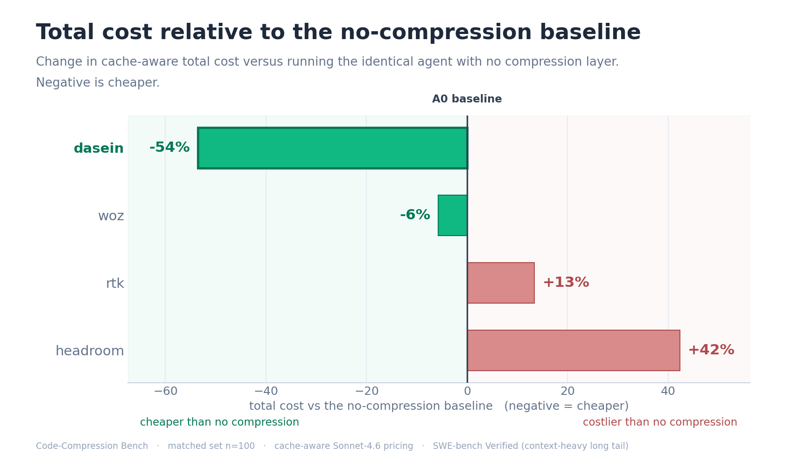
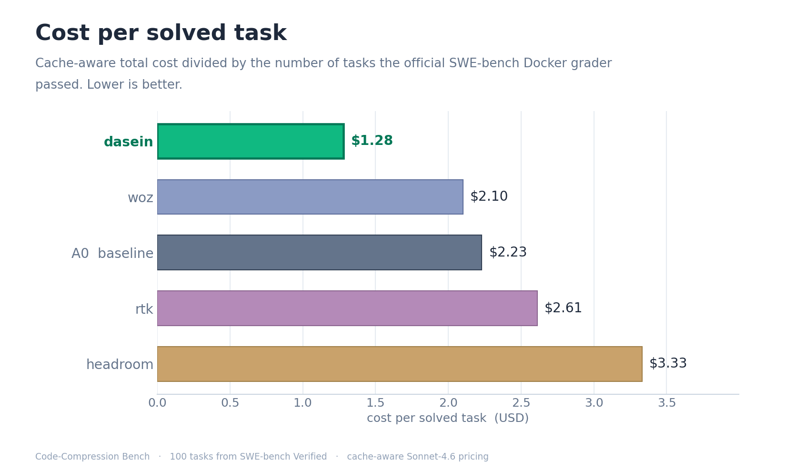
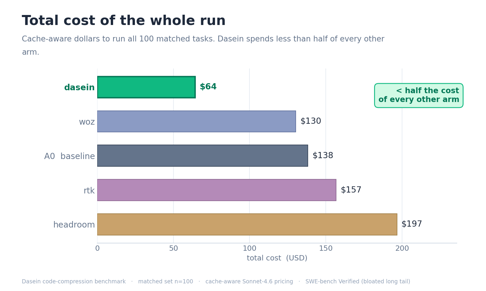
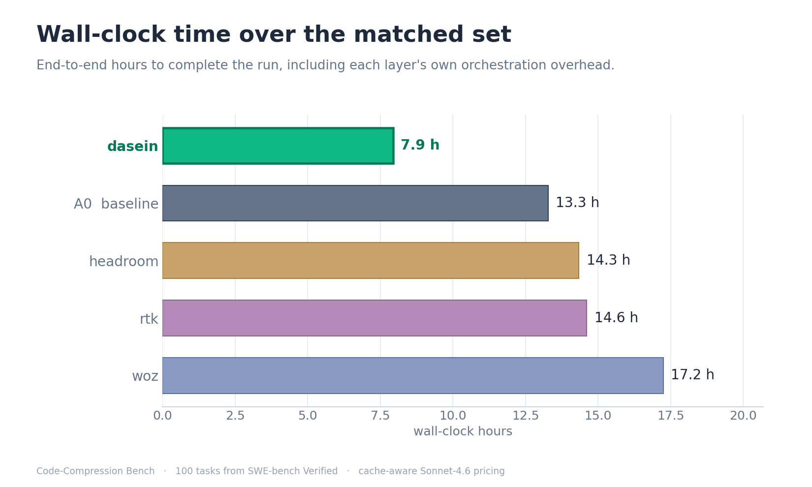
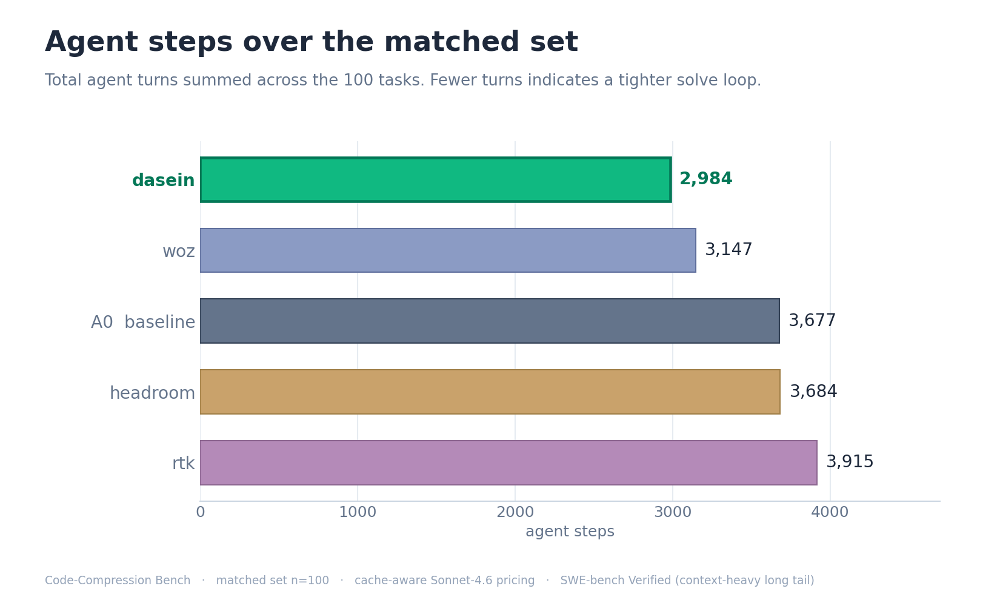
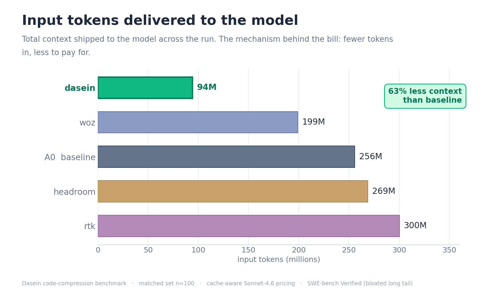
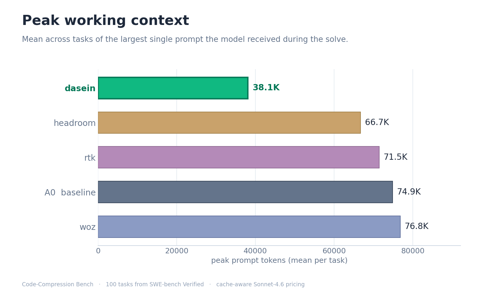
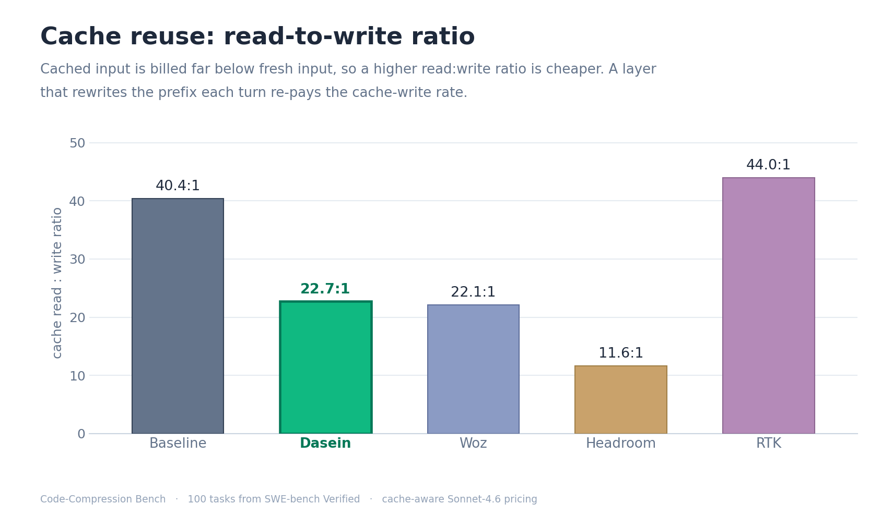
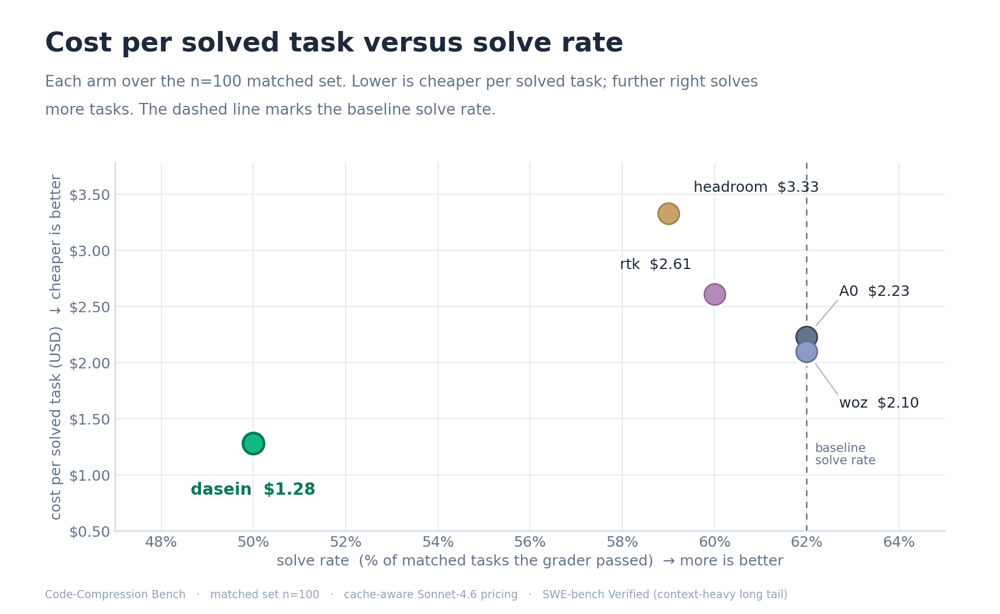

<h1 align="center">Code-Compression Bench</h1>

<p align="center">
  A reproducible, like-for-like benchmark of context-compression layers for coding agents.<br>
  One fixed agent, one model, one grader. Only the compression layer changes.
</p>

<p align="center">
  Built and maintained by <a href="https://daseinlabs.ai">Dasein</a> as an open resource for the industry.
</p>

<p align="center">
  <a href="FACT-VS-FICTION.md">Vendor claims vs measured</a> &nbsp;·&nbsp;
  <a href="results/2026-06-24/">Full results &amp; method</a> &nbsp;·&nbsp;
  <a href="results/2026-06-24/paired.csv">Per-task data</a> &nbsp;·&nbsp;
  <a href="https://raw.githack.com/daseinlabs/code-compression-bench/master/results/2026-06-24/dashboard.html">Interactive dashboard</a>
</p>

---

## Overview

Every "we cut your tokens by N%" claim is measured on a different agent, a different task set, and a
different success bar, so none of them are comparable, and none answer the question that matters: does the
agent still solve the problem, and what did it cost end to end? This benchmark fixes everything except the
compression layer. One scaffold (headless Claude Code), one model (`claude-sonnet-4-6`), 100 tasks from
SWE-bench Verified, and the official SWE-bench Docker grader are held identical for every arm; only the
compression layer changes, so any difference in cost or quality is attributable to it. Arms are ranked by
**cost per solved task** — cache-aware total cost divided by the tasks the grader passed — the figure a
coding team actually pays per result.

> Run 2026-06-24 · 100 tasks from SWE-bench Verified · model `claude-sonnet-4-6` · cache-aware pricing ·
> official SWE-bench Docker grader.

## Leaderboard

| Arm | Solved | $ / solved | Total cost | vs baseline | Input tokens | vs baseline | Wall-clock | Cache R:W |
|---|---:|---:|---:|---:|---:|---:|---:|---:|
| **Dasein** | 50 / 100 | **$1.28** | **$64.21** | **−54%** | **94.1M** | **−63%** | **7.9 h** | 22.7 |
| Woz | 62 / 100 | $2.10 | $130.29 | −6% | 199.2M | −22% | 17.2 h | 22.1 |
| Baseline (no compression) | 62 / 100 | $2.23 | $138.17 | — | 255.9M | — | 13.3 h | 40.4 |
| RTK | 60 / 100 | $2.61 | $156.72 | +13% | 300.3M | +17% | 14.6 h | 44.0 |
| Headroom | 59 / 100 | $3.33 | $196.65 | +42% | 268.9M | +5% | 14.3 h | 11.6 |

Dasein runs the full task set for **$64.21**, less than half of every other arm, and turns in the lowest cost
per solved task at **$1.28** — the next-cheapest arm (Woz) costs $2.10, 64% more per solved task. It is the
only arm that cut total cost versus the no-compression baseline. Woz reduced cost marginally (6%); RTK and
Headroom both cost more than doing nothing. The cost-per-solved metric already accounts for the fact that
Dasein solved fewer raw tasks on this set (discussed below), and it still ranks first.

The cache-aware pricing above is the conservative frame. Even at undiscounted list price — no cache
assumptions at all — the ordering is identical and the gap wider: Dasein costs **$287** to the baseline's
**$803** (−64%), against $613–805 for the other arms.

<p align="center">
  
</p>

## Cost

<p align="center">
  
  

</p>

Shipping fewer visible tokens is necessary for a real saving but not sufficient. Under cache-aware pricing
the model re-reads a long, mostly-cached prompt every turn, and a cached prefix is billed far below fresh
input. A layer that trims the visible prompt but rewrites the cached prefix each turn re-pays the expensive
cache-write rate; the bill only falls when the layer removes the *right* tokens without churning the cache or
adding turns. That is why two layers that reduce or barely change token counts still end up more expensive
than the baseline, and only Dasein converts compression into money.

## Time and steps

<p align="center">
  
  
</p>

Dasein completed the run in **7.9 hours**, 40% faster than the no-compression baseline and the fastest of any
arm, using the fewest agent steps (2,984). Woz was the slowest at 17.2 hours — 30% slower than the baseline —
and had the highest mean per-call latency (13.0 s versus the baseline's 9.0 s).

## Where the cost comes from

<p align="center">
  
  
</p>

Cost and time are outcomes; the drivers are how much context the model carries and how stable the prompt
cache stays underneath it. Dasein delivers **63% fewer input tokens** than the baseline and holds the model's
peak working context at **38K tokens on average — about half** the 67–77K every other arm carries.

<p align="center">
  
</p>

Cache reuse explains the most expensive arm. A cached prefix is billed far below fresh input, so a higher
read:write ratio is cheaper. Headroom's ratio is 11.6 — it rewrites the cached prefix often enough to re-pay
the cache-write rate repeatedly, which is why a layer that barely changed token counts (+5%) became the most
expensive (+42%). Dasein's ratio (22.7) sits below the baseline's (40.4) for the opposite, benign reason: it
carries far less cached context to begin with, so there is simply less cached prefix to re-read — fewer reads
over a small, stable prefix, not more writes — and its bill still falls 54%.

## Savings versus solve rate

<p align="center">
  
</p>

Plotting cost savings (up) against solve rate (right) puts the best arm in the top-right corner. Dasein leads
the savings axis outright at **+54%**, well clear of the baseline line that RTK (−13%) and Headroom (−42%)
sit below. The one axis where it trails is solve rate: Dasein solved 50/100 to the baseline's 62, trading a
few solves for less than half the cost — which is why the leaderboard ranks on cost per solved task (the
metric charges Dasein for the solves it gives up, and it still ranks first). Closing that solve-rate gap is
the one move that would carry Dasein from the top-left into the top-right corner.

## Every measured value

The complete per-arm rollup. Best value in each row is in bold.

| KPI | Dasein | Woz | Baseline | RTK | Headroom |
|---|---:|---:|---:|---:|---:|
| Tasks solved (of 100) | 50 | **62** | **62** | 60 | 59 |
| Cost per solved task | **$1.28** | $2.10 | $2.23 | $2.61 | $3.33 |
| Total cost | **$64.21** | $130.29 | $138.17 | $156.72 | $196.65 |
| List-price cost (no cache discount) | **$287** | $613 | $803 | $805 | $735 |
| Total cost vs baseline | **−54%** | −6% | — | +13% | +42% |
| Input tokens | **94.1M** | 199.2M | 255.9M | 300.3M | 268.9M |
| Input tokens vs baseline | **−63%** | −22% | — | +17% | +5% |
| Output tokens | **1.46M** | 2.69M | 2.55M | 2.80M | 2.70M |
| Agent steps | **2,984** | 3,147 | 3,677 | 3,915 | 3,684 |
| Wall-clock hours | **7.9** | 17.2 | 13.3 | 14.6 | 14.3 |
| Mean latency per call | **7.9 s** | 13.0 s | 9.0 s | 9.4 s | 10.4 s |
| Peak working context (mean) | **38.1K** | 76.8K | 74.9K | 71.5K | 66.7K |
| Cache hit rate | 92.7% | 93.4% | **95.9%** | 92.2% | 88.2% |
| Cache read:write ratio | 22.7 | 22.1 | 40.4 | **44.0** | 11.6 |
| Runs ended by context limit | **0** | **0** | **0** | **0** | 1 |
| API calls | 3,085 | 3,247 | 3,686 | 4,454 | 4,128 |

Cache read:write is the ratio of cached-prefix reads to cache writes; a lower ratio means the layer re-pays
the cache-write rate more often.

## Vendor claims versus measured

Each of the other layers advertises a large reduction in tokens, cost, or latency, but none of those headline
numbers is measured on what a coding team actually pays for — the cache-aware dollar cost of solving real
repository tasks with a multi-turn agent. They are measured on single-shot question-answering, single-document
QA, shell-command output in isolation, token counts with no task-success check, or "up to" ceilings.

| Layer | Headline claim | Measured on | Our result (n = 100) |
|---|---|---|---|
| Woz | "Cut your Claude Code costs in half" | Live-session API usage, undisclosed task mix; quality on Opus 4.7 vs an Opus 4.6 baseline | −6% cost, same solves as baseline, 30% slower |
| RTK | "60–90% fewer tokens on common dev commands" | Shell-command output in isolation (its own README: native Read/Grep/Glob bypass the hook) | +17% input, +13% cost |
| Headroom | "60–95% fewer tokens, same answers" | Single-shot QA (GSM8K, SQuAD…); its docs: "code passes through" uncompressed | +5% input, +42% cost (most expensive) |

This is a summary of the arms that ran. The detailed, fully-sourced breakdown of every layer — every quote,
every primary source, the exact benchmark each number was measured on, and the mechanism behind each gap — is
in **[FACT-VS-FICTION.md](FACT-VS-FICTION.md)**.

## Method

- **One scaffold.** A fixed agent: headless Claude Code, driven through the Python Claude Agent SDK,
  identical system prompt, tools, and caps for every arm.
- **One model.** `claude-sonnet-4-6` for every arm.
- **One task set.** 100 tasks from [SWE-bench Verified](https://www.swebench.com/); the exact instances are
  listed in [`paired.csv`](results/2026-06-24/paired.csv).
- **One grader.** The official SWE-bench Verified Docker harness. A task counts as solved only if its
  `fail_to_pass` tests pass and `pass_to_pass` stays intact. No partial credit, no model-as-judge.
- **One price table.** Cache-aware Sonnet-4.6 pricing — uncached input $3.00, cache-write $3.75, cache-read
  $0.30, output $15.00 per 1M tokens — applied to each arm's real per-call usage. Cost is cache-aware
  because a coding agent re-sends a long, growing prompt every turn and a cached prefix is billed far below
  fresh input; a naive list-price frame would flatter the shorter-prompt arms, so it is not used for the
  ranking.

Cost per solved task is the ranking metric because it cannot be gamed by either lever alone: a layer that
strips context aggressively can look cheap on tokens while failing more tasks, and a layer that solves a lot
can look strong while spending a fortune. Dividing real dollars by graded solves rewards the layer that
delivers correct patches for the least money.

Each compression product runs as its real product through its native interface (proxy, API, plugin, or hook);
we do not reimplement anyone's method. The `dasein` arm in this public repository is a thin over-the-wire
client to a hosted service — the repository contains no Dasein internals — wired in through the same adapter
contract every other arm uses.

Holding the scaffold and model fixed is what makes the per-arm delta clean; it also means the ordering is
specific to headless Claude Code on `claude-sonnet-4-6`.

## Reproduce

```bash
pip install -e .
gcloud auth application-default login        # model auth: claude-sonnet on Vertex
cp .env.example .env                          # per-arm endpoints / keys
make smoke                                    # one task per ready arm, end to end
make bench                                    # the full task set across every ready arm
make report                                   # regenerate figures, tables, and the leaderboard
```

Arms whose keys or endpoints aren't configured are skipped automatically
(`python -m bench.cc_runner --list-arms` shows what's ready). Every figure and table regenerates from a
single `summary.json`, so anyone who runs this gets the same numbers.

## Layout

```
bench/      core: arm interface, runner, grader, pricing, figures, report
arms/       one adapter per compression layer (proxy / API / plugin / hook)
results/    per-run records, figures, the interactive dashboard, and the generated reports
```

## License

Apache-2.0. Compression products referenced here are the property of their respective owners; this repository
contains only thin client adapters to their public interfaces.

<p align="center"><sub>Benchmark sponsored and operated by Dasein and built to be neutral: one fixed scaffold and model, an official third-party grader, one shared price table. Anyone can re-run it and check the numbers.</sub></p>
