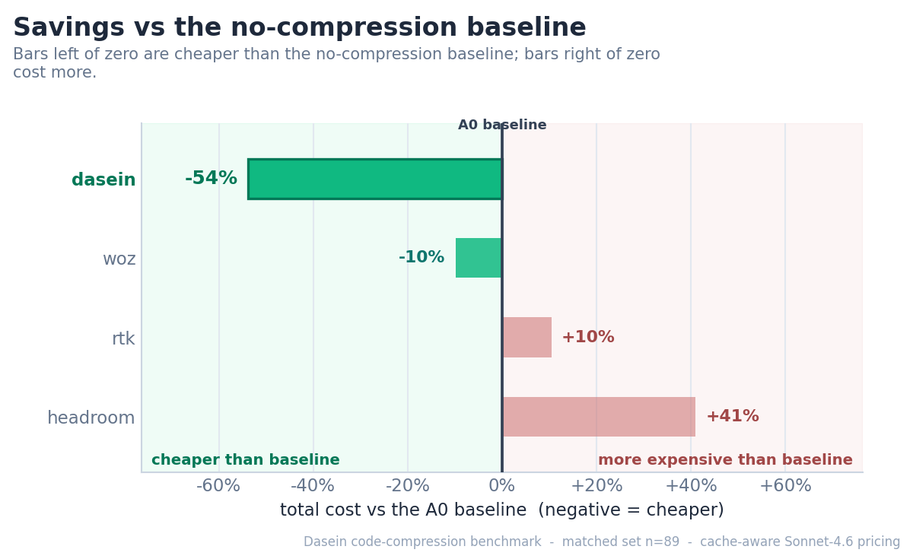

<h1 align="center">Code-Compression Bench</h1>

<p align="center">
  <b>A reproducible, apples-to-apples benchmark of context-compression layers for coding agents.</b><br>
  One fixed agent. One model. Same tasks, same grader. Only the compression layer changes.
</p>

<p align="center">
  <i>Built and maintained by <a href="https://daseinlabs.ai">Dasein</a> as an open resource for the industry.</i>
</p>

---

<h3 align="center">Dasein cuts ~54% of total cost vs no compression — the only arm that delivers a real cut.</h3>

<p align="center">
  <b>Latest run — <code>bloated-50</code>, n=89 matched tasks (2026-06-24).</b><br>
  −54% cost · −63% input · <b>$1.30 / solved task</b> (lowest of any arm) · cache 23:1.<br>
  The best competing layer shaves just ~10%; the rest cost <i>more</i> than running with no compression at all.<br>
  <a href="results/2026-06-24/">Full leaderboard, figures &amp; method →</a>
</p>

<p align="center">
  
</p>

---

## Why this exists

Every "we cut your tokens by N%" claim is measured on a different agent, a different task set, and a
different success bar — so none of them are comparable, and none tell you the thing that actually matters:
**does the agent still solve the problem, and what did it cost end-to-end?**

This benchmark fixes everything except the compression layer:

- **One scaffold** — a fixed agent: headless **Claude Code**, driven through the Python Claude Agent SDK.
- **One model** — **claude-sonnet on Vertex** (`vertex_ai/claude-sonnet-4-6`) for every arm, reached
  through an internal **usage gateway** that is the single bottom bridge to Vertex (auth = ADC on the box).
- **One task set** — a frozen slice of **SWE-bench Verified**, graded by the **official Docker harness**
  (a fix counts only if the repo's fail-to-pass tests pass and nothing else breaks).
- **One leaderboard** — ranked by real money: **cost per solved task**.

Each compression product plugs in through its **native interface** (proxy / API / MCP) — we don't
reimplement anyone's method. The grader doesn't care how a patch was produced, which is exactly what makes
the comparison fair.

## The task set — `bloated-50`

The 50 highest-token, longest-context instances of the held-out SWE-bench Verified 200 (`tasks_bloated50.json`).
These are the runs where context management actually matters — long tool-output trails, repeated file reads,
deep call stacks — i.e. the regime that separates a real compression layer from a no-op.

## Arms

| Arm | What it is | Integration |
|---|---|---|
| **Dasein** | Curates the agent's context at serve time with a learned model, wrapped in a full run-governance stack | Hosted, keyed service |
| **Woz** | Claude Code plugin: AST-aware tools + delegated exploration | MCP tool layer |
| **Edgee** | Open-source gateway: deterministic tool-output compression | Hosted gateway / self-host |
| **RTK** | Single Rust binary: shell-command-output compression via a Claude Code PreToolUse hook (`git status` → `rtk git status`) | Install binary; runs as a hook (model gateway-direct, like A0) |
| **Headroom** | Open-source, reversible context compression (6-signal scorer) | Self-host (Anthropic-native proxy) |
| **Compresr** | "Context Gateway" proxy: history + tool-output compaction | Self-host / hosted proxy |
| **Baseline (A0)** | The identical bare agent, no compression | — |

> _bear-1.2 (The Token Company) is access-gated (no self-serve API) and is currently a documented no-op;
> the adapter is wired and will activate when access is granted._

## Topology — the gateway is the single bottom bridge to Vertex

The model is **claude-sonnet on Vertex** (`vertex_ai/claude-sonnet-4-6`, auth = ADC on the box). The
vendor compression proxies only speak the **Anthropic API**, so an internal **usage gateway** speaks
Anthropic on its front and bridges to Vertex (via litellm) on its back. Crucially the gateway sits at the
**bottom** of every chain, so it always observes the **real post-compression usage** (the cache split
included) and writes it to a per-run JSONL.

```
A0 (baseline)   Claude Code ──(ANTHROPIC_BASE_URL=gateway)──> gateway ──> Vertex
proxy arms      Claude Code ──(ANTHROPIC_BASE_URL=vendor proxy)──> vendor proxy (compresses)
                            ──(vendor's UPSTREAM = gateway)──> gateway ──> Vertex
woz             Claude Code ──(ANTHROPIC_BASE_URL=gateway)──> gateway ──> Vertex   (+ Woz MCP tools)
rtk             Claude Code ──(ANTHROPIC_BASE_URL=gateway)──> gateway ──> Vertex   (model direct like A0;
                            PreToolUse hook rewrites Bash <cmd> -> rtk <cmd>, compressing shell stdout)
```

- **Vertex auth = ADC** on the runner box: `gcloud auth application-default login`. No API key is used
  for the model. `VERTEX_PROJECT` / `VERTEX_LOCATION` (default `dasein-473321` / `us-east5`) and
  `VERTEX_MODEL` select the endpoint.
- We do **not** set `CLAUDE_CODE_USE_VERTEX` — Claude Code speaks the Anthropic API to the proxy/gateway
  above it; only the gateway bridges to Vertex. Claude Code is handed a dummy **bridge token**
  (`ANTHROPIC_AUTH_TOKEN`); the real Vertex credential lives on the gateway.
- **Per-vendor upstream config (provisioning requirement):** each PROXY arm must be configured to
  forward to the gateway URL. By default the runner starts a fresh gateway per solve on a random
  ephemeral port — fine for baseline/woz, but a vendor proxy can't chase a moving port. For the proxy
  arms, launch the **shared standalone gateway** at a FIXED address instead and point every vendor's
  upstream at it (once):

  ```bash
  # one long-lived gateway on a fixed port (Vertex bridge, run-id-isolated, ThreadingHTTPServer)
  python -m bench.gateway_server --port 8080 --usage-dir runs/usage    # prints CCB_GATEWAY_URL=...
  # then run the bench against it — baseline/woz point at it; proxy arms' upstream is provisioned to it
  CCB_GATEWAY_URL=http://127.0.0.1:8080 CCB_GATEWAY_USAGE_DIR=runs/usage \
    python -m bench.cc_runner --arms baseline,dasein ...
  ```

  When `CCB_GATEWAY_URL` is unset the per-run ephemeral behaviour is unchanged. See `arms/README.md`
  for exactly where that upstream is set for edgee / headroom / compresr / dasein. (**rtk is NOT a
  proxy** — it's the rtk-ai/rtk binary run as a PreToolUse hook; install the binary on the runner, the
  model goes straight to the gateway like A0, and there is no upstream to set.)

## Leaderboard

<!-- BENCH:START -->
**Latest published run — `bloated-50`, n=89 matched tasks (2026-06-24).** Ranked by `$/solved` (cache-aware
cost ÷ Docker-graded solves). Full figures, method, and honest caveats:
[`results/2026-06-24/`](results/2026-06-24/).

| arm | solved | $/solved | total $ | vs A0 cost | vs A0 input | cache r:w |
|---|---|---|---|---|---|---|
| **Dasein** | 45/89 | **$1.30** | $58.70 | **−54%** | **−63%** | 23:1 |
| woz | 54/89 | $2.12 | $114.34 | −10% | −29% | 20:1 |
| A0 (baseline) | 54/89 | $2.35 | $126.92 | — | — | 40:1 |
| rtk | 55/89 | $2.55 | $140.13 | +10% | +15% | 43:1 |
| headroom | 52/89 | $3.44 | $178.90 | +41% | +2% | 11:1 |

Dasein is the only arm that meaningfully cuts cost vs the no-compression baseline: woz shaves ~10%, while
rtk and headroom cost **more** than doing nothing. Dasein trades a few solves for the cut (45 vs the
baseline's 54) but remains the cheapest per **solved** task by a wide margin. Helper-model calls (woz's MCP
subagents, Dasein's haiku scout/adjudicator) are kept out-of-band overhead — never blended into these
same-model columns — so the comparison stays apples-to-apples. _compresr infra-failed on the bloated tasks
and is excluded._
<!-- BENCH:END -->

## Reproduce it

```bash
# 1. Install
pip install -e .

# 2. Auth the model: claude-sonnet on Vertex via Application Default Credentials
gcloud auth application-default login    # ADC on the box — no model API key needed

# 3. Configure — copy the template and fill per-arm keys + (optional) Vertex overrides
cp .env.example .env        # MODEL + per-arm endpoints; VERTEX_PROJECT/LOCATION default to dasein-473321/us-east5

# 4. (self-host proxy arms) launch the local proxies — each forwards to the gateway URL
make selfhost-up            # edgee / headroom / compresr proxies (set their upstream = gateway)
#    rtk is NOT a proxy: install the rtk-ai/rtk binary on the runner instead
#    (brew install rtk  |  curl -fsSL .../install.sh | sh  |  cargo install --git ...)

# 5. Smoke one task per arm, then the full set
make smoke                  # 1 task per ready arm, end-to-end + grade
make bench                  # the full bloated-50 across every ready arm (8 workers)

# 6. Figures + leaderboard + README injection
make report
```

Every arm runs the **same** model through the **same** scaffold; only the compression layer differs. Arms
whose keys/endpoints aren't configured are skipped automatically (`python -m bench.cc_runner --list-arms`
shows what's ready). Anyone who runs this gets the same figures and leaderboard regenerated from their own
results.

## Methodology & fairness

- **Identical everything but the layer:** same system prompt, tools, model, caps, and task set across arms.
- **Outcome-graded:** success = the official SWE-bench Verified Docker grader (`fail_to_pass` resolved,
  `pass_to_pass` intact). No LLM-judging.
- **Honest accounting:** tokens and cost come from each arm's own API usage; cost is cache-frame priced
  per-model (`bench/pricing.py`). The leaderboard reports the real computed numbers — only the ranking
  metric is chosen (cost/solved → cost/success → success-rate).
- **Product vs product:** each arm runs as its real product (a proxy, an API, or an agent plugin), not a
  reimplementation. Where a vendor's layer changes the agent's tools (e.g. an MCP plugin), that is part of
  what's being measured.

## Layout

```
bench/      core: arm interface, runner, grader, pricing, figures, report
arms/       one adapter per compression layer (transform / proxy / tool)
selfhost/   docker-compose for the self-hosted proxy arms
results/    per-run records, figures, and the generated REPORT.md
```

## License

Apache-2.0. Compression products referenced here are the property of their respective owners; this repo
contains only thin client adapters to their public interfaces.
