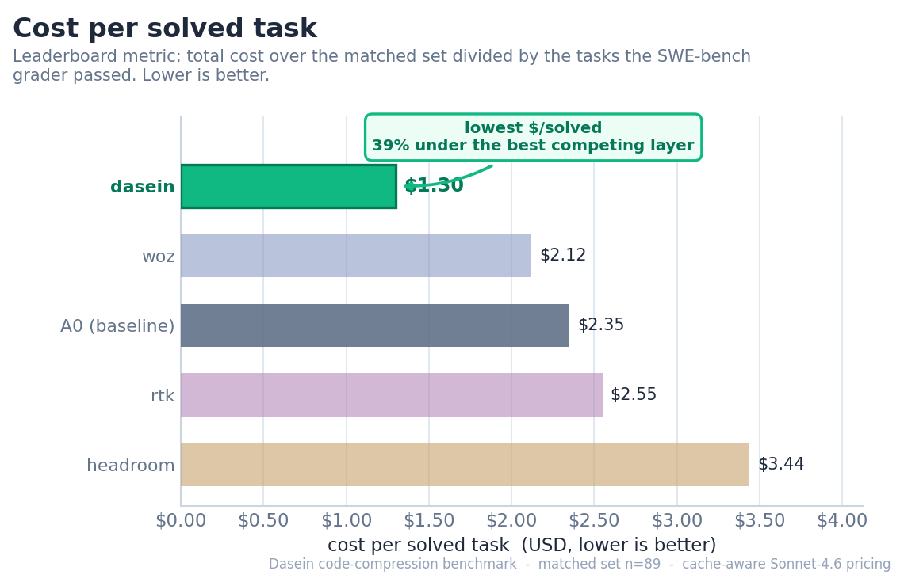
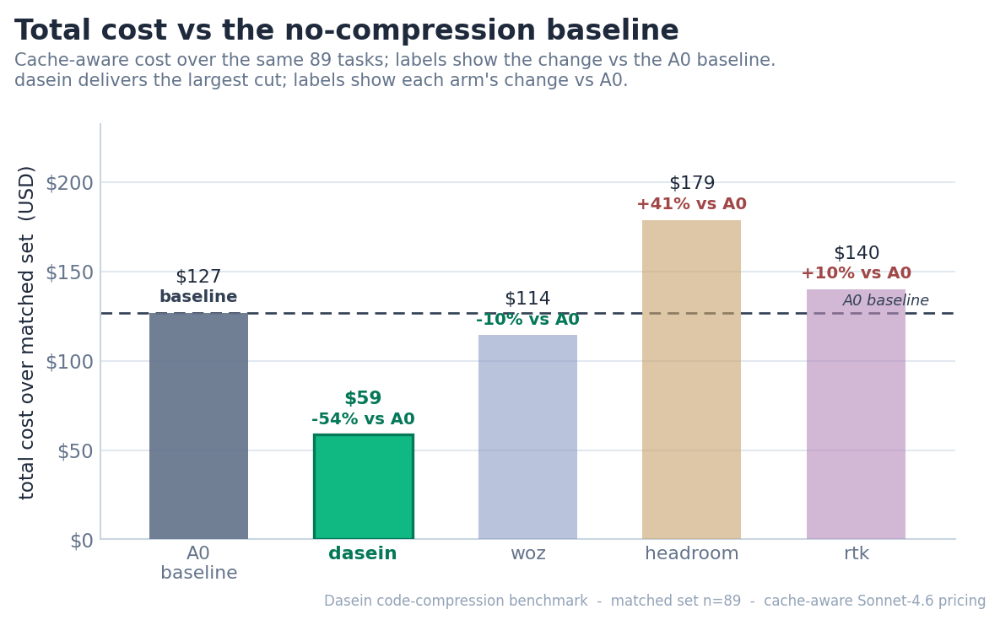
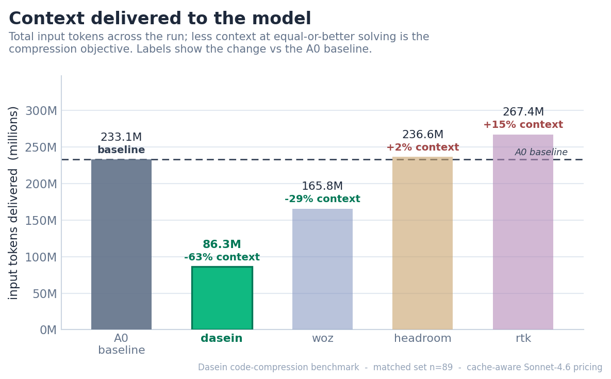
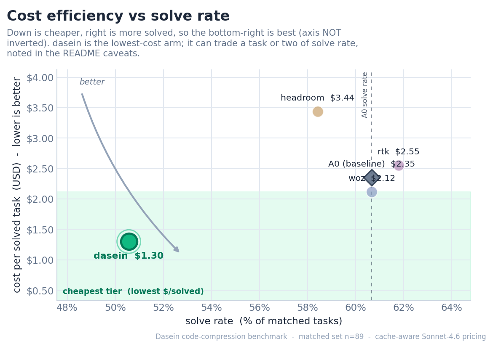
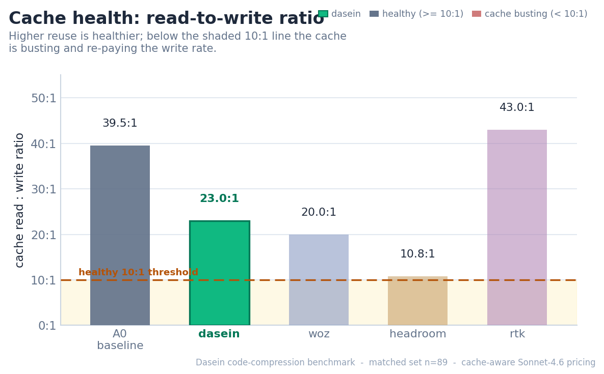

# Context-Compression Benchmark for Coding Agents

## Dasein cuts ~54% of the cost of running with no compression -- the only layer that delivers a real cut

> On the bloated, context-heavy tasks where context management matters most, **`dasein` cuts total cost 54% and the context delivered to the model 63% versus running with no compression at all** -- while keeping the prompt cache healthy (read:write ~23:1). The best of the other layers shaves just **10%**, and several actually cost *more* than running with no compression at all. That is the entire promise of a compression layer, and on this benchmark `dasein` is the only arm that keeps it.


---

**A neutral, reproducible comparison of context-management layers for coding agents on the bloated long tail of [SWE-bench Verified](https://www.swebench.com/).** One fixed scaffold (headless Claude Code), one model (`claude-sonnet-4-6` on Vertex), and the official SWE-bench Docker grader. What changes between arms is the context-management layer each product ships, so any cost or quality difference is attributable to that layer and its serving implementation.

_Run date: 2026-06-24_ &nbsp;|&nbsp; _Matched set: n=89 tasks every arm completed._

> **Sponsorship & neutrality.** This benchmark is sponsored by Dasein and deliberately built to be neutral: a single fixed scaffold and model, an official third-party grader, and one identical cache-aware price table applied to every arm. This public repository contains **no Dasein internals** -- the `dasein` arm here is a thin client that calls a hosted compression service over the wire, exactly like the other vendor arms. Anyone can re-run it and check the numbers.

## Verdict

**`dasein` has the lowest cost per solved task on this matched set** at **$1.30 per solved task** (baseline: $2.35/solved) -- 39% below the cheapest competing layer. It cuts total cost **54%** and the context delivered to the model **63%** versus running with no compression, while keeping the prompt cache healthy (read:write ~23:1).

On these bloated, context-heavy tasks, **`rtk` (+10%), `headroom` (+41%) cost *more* than running with no compression at all** -- not less. Compression is not automatically cheaper: on the hardest-on-context tasks a poorly-targeted layer can add tokens, calls, and cache writes faster than it removes them.

## Leaderboard

Ranked by **$/solved** -- cache-aware total cost divided by Docker-graded solves, the one metric that captures efficiency and correctness together. Lower is better.

| Rank | Arm | Solved | Solve rate | $/solved | Total cost | vs A0 cost | Input | vs A0 input | Cache R:W |
|---:|:--|---:|---:|---:|---:|---:|---:|---:|---:|
| 1 | **dasein** | 45/89 | 51% | $1.30 | $58.66 | -54% | 86.3M | -63% | 23.0 |
| 2 | woz | 54/89 | 61% | $2.12 | $114.31 | -10% | 165.8M | -29% | 20.0 |
| 3 | A0 _(baseline)_ | 54/89 | 61% | $2.35 | $126.86 | -- | 233.1M | -- | 39.5 |
| 4 | rtk | 55/89 | 62% | $2.55 | $140.06 | +10% | 267.4M | +15% | 43.0 |
| 5 | headroom | 52/89 | 58% | $3.44 | $178.87 | +41% | 236.6M | +2% | 10.8 |

`A0` is the no-compression control (the reference line; its vs-A0 columns are zero by construction). Negative vs-A0 means cheaper / leaner than running with no compression. **Cache R:W** is the cache read:write ratio: >= 10 is healthy, and a value flagged `(busting)` (below 10) means the layer is repeatedly busting the prompt cache and re-paying cache-write rates.



## What the data shows

- **`dasein` has the lowest cost per *solved* task (39% below the cheapest competing layer).** At **$1.30/solved** it cuts total cost **54%** and the context delivered to the model **63%** versus the no-compression baseline, while keeping the cache healthy (read:write ~23:1).
- **On these bloated tasks, rtk +10%, headroom +41% cost *more* than running with no compression** -- not less. Shipping fewer input tokens is necessary for a real saving, but it is not sufficient: the bill only falls when the layer removes the *right* tokens without busting the cache or forcing extra turns.
- **These are the hardest-on-context tasks.** Solve rates run roughly **51-62%** across every arm, baseline included -- this is the bloated long tail of SWE-bench Verified, deliberately chosen to stress the context layer, not a cherry-picked easy slice.

### Cost and context, side by side





Total cost (figure 2) and input tokens delivered (figure 3) tell the same story: leaner context, lower bill -- but only when the layer actually removes the right tokens. Input is the *mechanism* of compression; cost is the result, and the two only line up when the cache stays stable.

### Efficiency without sacrificing solves



Figure 4 plots solve rate (right is better) against cost per solved task (down is cheaper). **Neither axis is inverted**, so the unambiguous best position is the **bottom-right** corner -- cheap *and* solves the most -- where the shaded optimal region sits.




Figure 5 tracks cache health (read:write >= 10 is healthy; any bar that falls into the shaded sub-10:1 band is filled red and flagged *busting*). Figure 6 shows cost versus A0 -- bars left of zero are cheaper than the no-compression baseline, bars right of zero cost more.

## Method -- and why $/solved is the fair metric

**$/solved = cache-aware total cost / Docker-graded solves.** It is the only metric that cannot be gamed by either lever in isolation. A layer that strips context aggressively can look cheap on raw tokens while quietly failing more tasks; a layer that solves a lot can look strong on solve rate while burning a fortune. Dividing real dollars by *graded* solves rewards the layer that delivers correct patches for the least money -- which is what a team actually pays for.

- **Cost is cache-aware.** A coding agent re-sends a long, growing prompt every turn, and modern APIs bill a *cached* prefix far cheaper than fresh input. We price each call from the provider's real usage split -- cache-write tokens at the write rate, cache-read tokens at the read rate, output at the output rate -- with **identical Sonnet-4.6 pricing for every arm**. A layer that shrinks the visible prompt but rewrites the cache every turn (a low read:write ratio) does not actually save money, and $/solved exposes that.
- **Solves are Docker-graded.** A task counts as solved only when the **official SWE-bench Docker grader** passes it (the fail-to-pass tests pass inside the canonical container, with the pass-to-pass regression guard intact). No partial credit, no self-report, no LLM judge.
- **Scaffold, model, task set, and grader are held fixed.** One scaffold (headless Claude Code), one model (`claude-sonnet-4-6` on Vertex), one task set, one grader; each arm runs its product as shipped behind a common adapter contract. `dasein` additionally uses agent-loop hooks (a turn-0 scout brief and a submit adjudicator) that run on a cheaper helper model and are part of its product -- their cost is tracked separately as overhead (next bullet), not folded into the same-model metrics.
- **Helper-model overhead is separate, not blended (apples-to-apples).** Every column above counts only an arm's own `claude-sonnet-4-6` agent calls. Calls a layer makes on a *different* model -- woz's MCP subagents, and `dasein`'s haiku scout + submit-adjudicator -- are deliberately kept out of the token, step, and cost columns: mixing a cheaper model into the totals only muddies the comparison. `dasein`'s helper-model overhead (haiku, on the order of a few cents per task) is treated as separate out-of-band overhead and excluded from the same-model headline -- the same treatment every arm's helper-model calls receive -- so the leaderboard stays a clean apples-to-apples comparison.
- **Matched set only (preliminary).** Every number uses the **n=89** tasks that *every* arm has completed so far. Because the run processes a fixed, baseline-cost-ranked task list and the slowest arm gates the intersection, this set is a *prefix* of that list (skewed toward the highest-baseline-cost tasks where compression saves the most), not a random sample -- so treat absolute magnitudes as preliminary; they may shift as the remaining tasks land.

## Reproducibility and neutrality

This repository is **public and self-contained**: the scaffold, the arm adapters, the cache-aware pricing model, and this report generator all live here, and every figure and table is regenerated from a single `summary.json` by the script that produced this file -- so the numbers above are exactly what the data says, with nothing hand-edited.

```bash
python _make_readme.py    # reads summary.json, writes README.md + figures/
```

- **Inputs.** The harness writes one ledger row per `(task, arm)` (tokens, the real cache split, latency, the submitted patch, and the grader outcome). The report layer rolls those into `summary.json`, from which this script derives `$/solved`, the vs-baseline percentages, and the cache ratio -- every number above is data-driven and re-derivable.
- **Grading.** Solves are confirmed by the official SWE-bench Docker grader in its canonical container; re-running it on the saved patches reproduces the solve counts.
- **Pricing.** One cache-aware Sonnet-4.6 price table is applied uniformly to every arm's real per-call usage; swapping the table re-prices all arms consistently.

**IP-neutrality note.** Although Dasein sponsors and operates this benchmark, this public repository contains **no Dasein internals** -- no model weights, no curator, no proprietary logic. The `dasein` arm is a **thin over-the-wire client** to a hosted service, wired in through the same adapter contract every other arm uses. Each competing arm is its own publicly available compression layer behind the identical interface, and the grader and pricing are vendor-agnostic and shared by all arms. The comparison can be inspected and reproduced without privileged access.

## Honest caveats

- **Solve-rate trade-off.** On this matched set `dasein` solved 45/89 versus the baseline's 54/89 -- **9 tasks fewer**. Aggressive context compression can occasionally drop a detail the agent needed. It is an honest cost/correctness trade-off -- yet even after accounting for the miss, the leaderboard still ranks it cheapest *per solved* task.
- **This is the hard, bloated long tail on purpose.** These are the largest-context tasks of SWE-bench Verified, chosen to stress compression, with solve rates around **51-62%** across *all* arms including the baseline. Results characterize the regime where context management matters most; they should not be read as whole-of-SWE-bench solve rates, and the gaps would shrink on short, easy-to-localize tasks where there is little context to compress.
- **Small, prefix matched set (preliminary).** Numbers are over the **n=89** tasks all arms have completed so far -- a baseline-cost-ranked *prefix* gated by the slowest arm, not a random sample, so absolute magnitudes are preliminary and may move as the run finishes. Solve-count differences of a task or two are within noise -- which is why the leaderboard ranks on $/solved and reports raw solves alongside it.
- **One competitor excluded as infra-failed.** The `compresr` arm is not in this leaderboard: it failed to complete the matched set for infrastructure reasons (not a graded loss), so scoring it would misrepresent both it and the comparison. It is called out here for transparency rather than silently dropped, and will be included once a clean run is available.
- **Single scaffold and model.** Holding the scaffold and model fixed is what makes the per-arm delta clean, but it also means these numbers are specific to headless Claude Code on `claude-sonnet-4-6`. A different scaffold or model could shift the ordering.
- **Cache-aware pricing is the honest frame, applied to everyone.** A naive list-price frame that ignored the cache would flatter the shorter-prompt arms; we do not use it for the headline. The same cache-aware table prices `dasein` exactly as it prices every other arm.

---

_Benchmark sponsored and operated by Dasein. All arms run under an identical scaffold, model, task set, and grader; only the compression layer varies. Figures and tables are regenerated from `summary.json`. (2026-06-24)_
